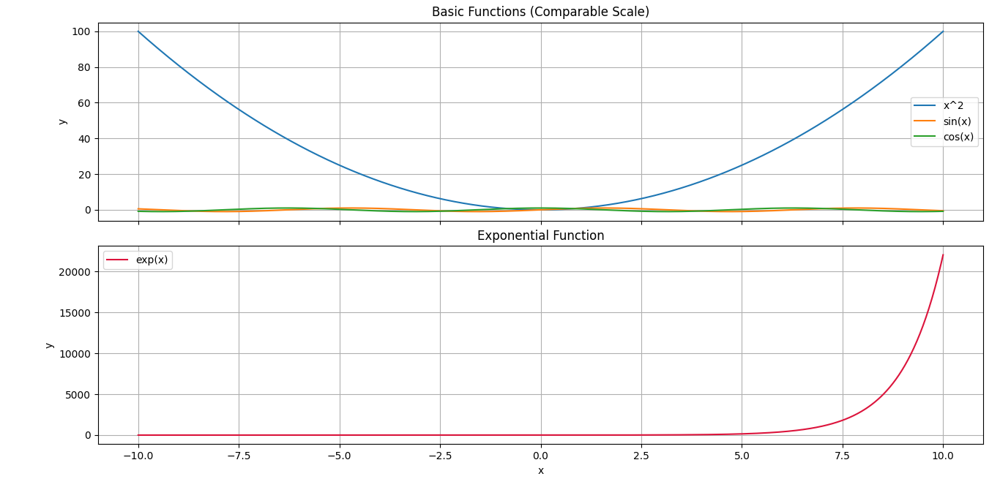
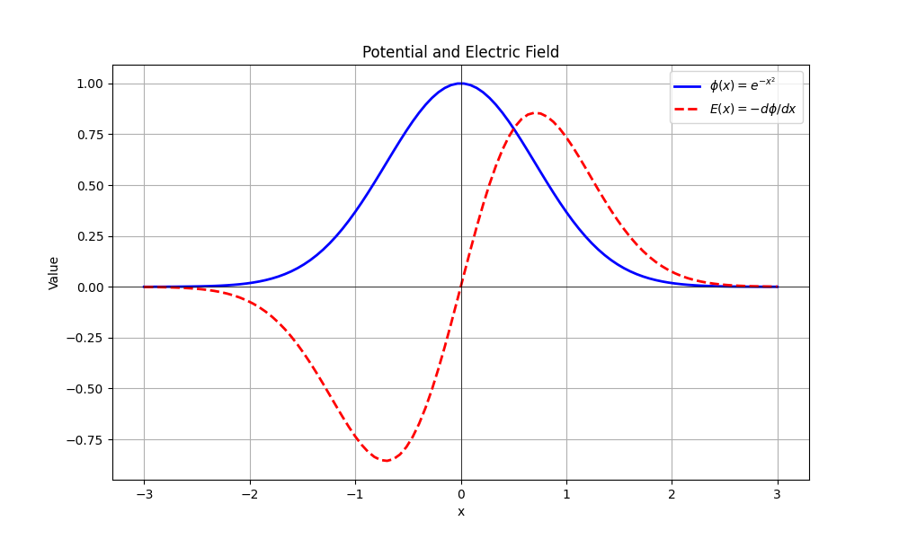
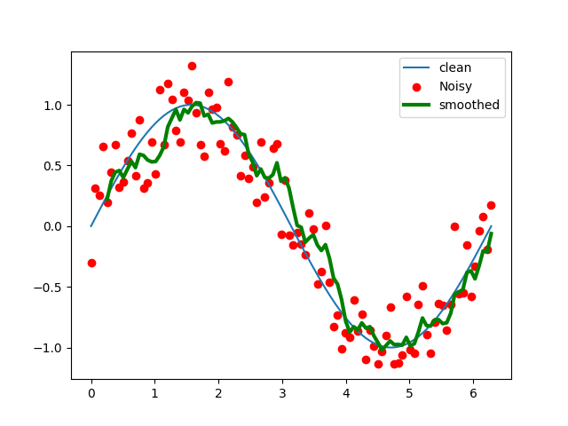
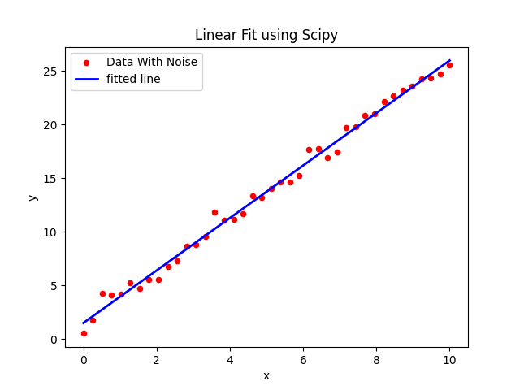
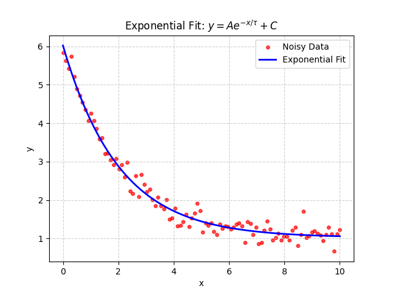
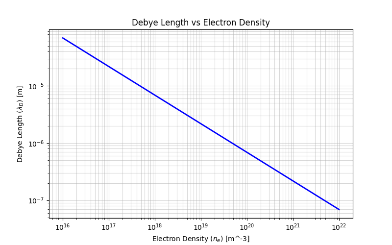

# daily-python-practice

This repository contains my daily Python practice exercises focused on numerical methods, data analysis, and basic plasma physics applications.

## Topics covered
- Plotting scientific functions
- Numerical derivative
- Numerical integration
- Noise reduction and averaging
- Exponential curve fitting
- Linear fitting
- Debye length calculation

## Files
- `plasma-python-practice.py` — Basic plotting practice
- `plasma-python-practice2.py` — Numerical derivative of a potential function
- `plasma-python-practice3.py` — Simple numerical integration
- `plasma-python-practice4.py` — Noise and averaging
- `plasma-python-practice5.py` — Linear fit
- `plasma-python-practice6.py` — Exponential fit
- `plasma-python-practice7.py` — Debye length calculation

## Figures

### Exercise 1

### Exercise 2

### Exercise 4

### Exercise 5

### Exercise 6

### Exercise 7

## Tools used
- Python
- NumPy
- Matplotlib

## Purpose
This repository is part of my practice in scientific programming and computational physics.
